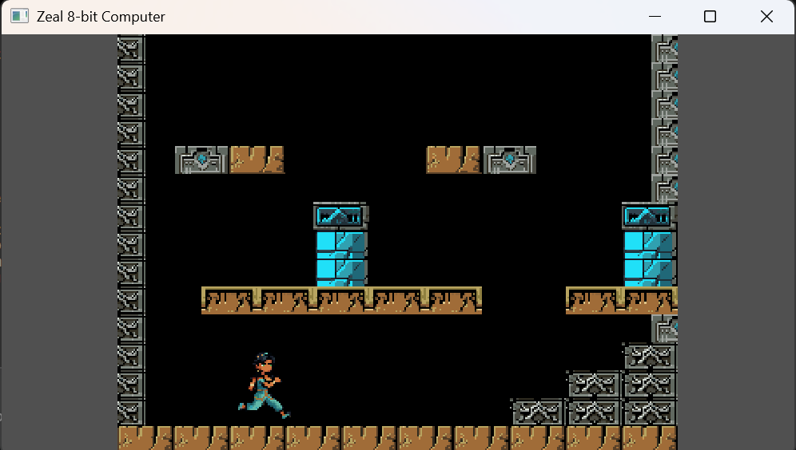

# Princess Parkour 

A running and jumping game for Zeal 8-bit Computer.

You are Princess Jade, trapped in the depths of the labarinth
deep beneath the palace, by the Sorcerous Saphire of the
nefarious Crimson Scorpions, the shadowy group conspiring to
keep you from your rightful place as the new Sultan.  You 
have just 7 hours to make it back to the surface and claim your
crown.

To get there you need to roll, jump, climb and run past all
of the infernal traps that scatter the depths.  Get there on
time and you will be crowned as ruler.

## How to run

Currently in a single binary, so just transfer it to your
Zeal computer and type: ./ppar.bin

## Credits

By hardhatpsp

Tools: gimp, aseprite, tiled, V.S. Code, SDCC and thanks to the Zeal 8-bit team.

Art mostly hand drawn based on https://rauchen.itch.io/the-dude pose references and a little help from https://pixellab.ai
